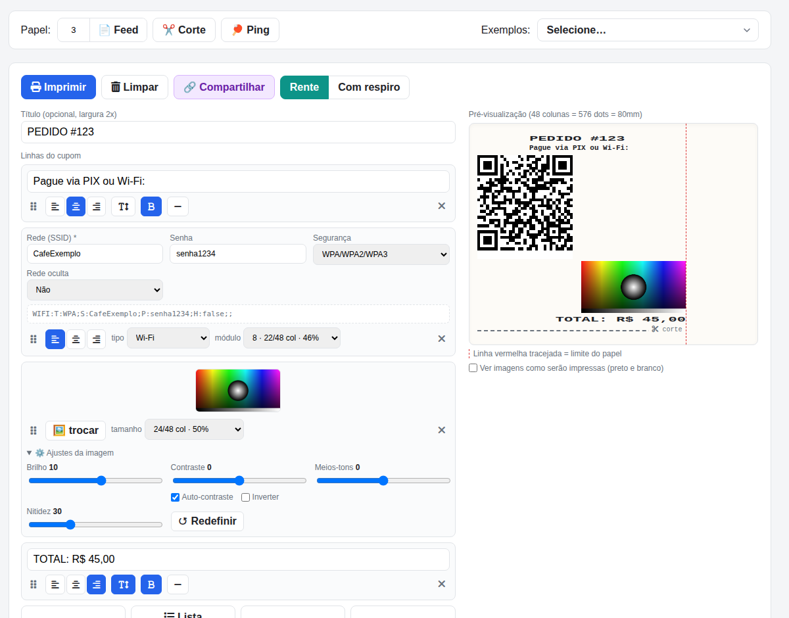
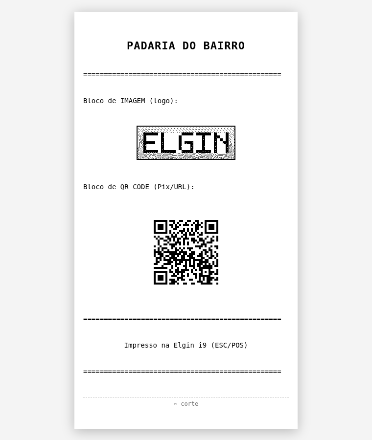

# Elgin I9 Printer 🖨️

Serviço de impressão para a **impressora térmica Elgin I9** (ESC/POS via USB) — num **único binário Go estático**:
CLI, API REST documentada (Swagger + OpenAPI + `llms.txt`) e uma **Web UI** para montar cupons, tudo embutido no executável.

- **Binário `elgin-print`**: um arquivo, zero dependências no destino (Linux e Windows).
- **CLI**: subcomandos `print`, `serve`, `feed`, `cut`.
- **API REST**: imprime cupons com texto, listas, **imagens** e **QR codes**; tem prévias que não gastam papel e **exemplos prontos** com endpoint.
- **Web UI**: editor visual com pré-visualização na escala do papel, ajustes de imagem, QR por tipo (Wi-Fi, PIX, vCard…), exemplos e **link de compartilhamento**.
- **📚 Documentação técnica completa**: [`docs/impressora-elgin-i9.md`](docs/impressora-elgin-i9.md) — comandos ESC/POS, corte, feed físico, DIP switches, beep e pitfalls.



## Índice

- [Início rápido](#início-rápido)
- [Compilando](#compilando)
- [Como usar (CLI)](#como-usar-cli)
- [Como usar (API)](#como-usar-api)
- [Documentação da API (Swagger, OpenAPI, llms.txt)](#documentação-da-api-swagger-openapi-llmstxt)
- [Imagens](#imagens) · [QR code](#qr-code) · [Exemplos](#exemplos)
- [Web UI](#web-ui)
- [Variáveis de ambiente](#variáveis-de-ambiente)
- [Desenvolvimento](#desenvolvimento) · [Deploy](#deploy) · [Estrutura do projeto](#estrutura-do-projeto)
- [Detecção da impressora](#detecção-da-impressora-linux) · [Windows](#windows)
- [Notas técnicas (pitfalls)](#notas-técnicas-pitfalls)

## Início rápido

```bash
go build -o elgin-print .      # ou: make build
./elgin-print serve            # sobe a API + Web UI em http://localhost:8000/
```

Abra `http://localhost:8000/` no navegador (editor) ou `http://localhost:8000/docs/` (Swagger). Para testar a
impressora de ponta a ponta: `curl http://localhost:8000/ping` (imprime **PONG!** grande).

## Compilando

O projeto usa [mise](https://mise.jdx.dev/) para a versão do Go (definida em
[`mise.local.toml`](mise.local.toml) — `go 1.26.6`):

```bash
mise install          # instala a versão do Go declarada
mise exec go --version
```

**Linux (binário estático — roda em Alpine/musl):**

```bash
CGO_ENABLED=0 GOOS=linux GOARCH=amd64 go build -trimpath -ldflags "-s -w" -o elgin-print .
```

**Windows (exe):**

```powershell
$env:CGO_ENABLED="0"; $env:GOOS="windows"; $env:GOARCH="amd64"
go build -trimpath -ldflags "-s -w" -o elgin-print.exe .
```

**Testes e lint:**

```bash
go vet ./... && go test ./...      # ou: make vet test
```

Os testes **não precisam da impressora**: um `TestMain` aponta o device para um arquivo temporário e os testes dos
endpoints trocam o envio por um falso.

Há um CI (`.github/workflows/build.yml`) que roda `go vet`, `go test` e gera os binários Linux/Windows a cada push/PR,
e outro (`.github/workflows/build-binaries.yml`) que gera os binários **Linux e Windows** em PRs. Os binários ficam como
artefatos do Actions — **o CI não faz deploy** (veja [Deploy](#deploy)).

## Como usar (CLI)

```bash
./elgin-print print                        # cupom de teste completo
./elgin-print print "texto"                # mensagem centralizada + moldura + corte
./elgin-print print -e "esq" -c "centro" -d "dir"   # multilinha com alinhamentos
./elgin-print print -t "Título" -c "texto"          # título 2x + corpo
./elgin-print print -f -c "texto"          # com respiro de 3 linhas antes do corte
./elgin-print feed 5                       # avança 5 linhas
./elgin-print cut                          # aciona a guilhotina
```

O corte é automático (`GS V 66 0`), enviado em write separado com delay para não furar o buffer. ✂️

## Como usar (API)

> ⚠️ Os endpoints que **imprimem** (`/print`, `/feed`, `/cut`, `/ping`, `/test-print`, `/exemplos/{id}/print`) gastam
> papel e acionam a guilhotina. **Não há autenticação**: se o servidor for acessível fora da rede interna, ponha um proxy
> com senha na frente.

| Endpoint | O que faz | Imprime? |
|---|---|---|
| `GET /health` | status real da impressora (`pronta` / `indisponivel`) | não |
| `POST /print` | imprime um cupom (corpo JSON, abaixo) | **sim** |
| `POST /feed` | avança o papel — `{"linhas": N}` | sim |
| `POST /cut` | aciona a guilhotina | sim |
| `GET /ping` | teste ponta a ponta: imprime **PONG!** em fonte gigante, responde `pong` | **sim** |
| `GET /qr?text=…&tamanho=` | o QR como PNG, exatamente como sai no papel | não |
| `GET /qr/info?text=…` | lado do QR em módulos (para escolher o tamanho) | não |
| `POST /imagem/preview` | PNG preto e branco de uma imagem, com os mesmos ajustes da impressão | não |
| `GET /exemplos` · `GET /exemplos/{id}` | lista e cupom dos exemplos prontos (corpo do `/print`) | não |
| `POST /exemplos/{id}/print` | imprime um exemplo | **sim** |
| `GET /test-grayscale` · `POST /test-print` | degradê de 16 tons (PNG) / imprime o degradê | não / **sim** |
| `GET /docs/` · `GET /openapi.json` · `GET /llms.txt` | documentação (veja abaixo) | não |
| `GET /` | Web UI no navegador; JSON de documentação para `curl` (`Accept: */*`) | não |

```bash
curl http://<host>:8000/health

# cupom personalizado
curl -X POST http://<host>:8000/print \
  -H 'Content-Type: application/json' \
  -d '{
    "titulo": "PEDIDO #123",
    "linhas": [
      {"texto": "-X-", "alinhamento": "esquerda", "linha": true},
      {"texto": "1x Hamburguer", "alinhamento": "esquerda"},
      {"texto": "TOTAL: R$ 45,00", "alinhamento": "direita", "fonte": "larga", "negrito": true},
      {"texto": "-X-", "alinhamento": "esquerda", "linha": true}
    ]
  }'
```

**Corpo do `POST /print`:** `titulo` (opcional, fonte larga, centralizado), `linhas` (blocos, em ordem) e `compact`
(`true`/ausente = corte rente à última linha; `false` = 3 linhas de respiro antes do corte). Cada bloco é **texto**,
**imagem** ou **QR code**, identificado por `tipo`.

**Bloco de texto** (`tipo` ausente ou `texto`):

- `texto` — quebra automaticamente em várias linhas se passar da largura (48 caracteres; 24 na fonte larga; 6 na gigante)
- `alinhamento` — `esquerda` | `centro` (padrão) | `direita`
- `fonte` — `normal` | `larga` (largura 2x) | `gigante` (largura 8x e altura 4x; senhas e destaques)
- `negrito` — `true`/`false`
- `linha` — `true` repete o `texto` até preencher a linha (ex.: `"-X"` vira `-X-X-X-X-...`)

Acentos e símbolos usam a code page **PC860**; o que não existe nela vira `?` e **emojis não são suportados como texto**
(envie-os como imagem). Todos os campos, limites e exemplos estão no Swagger.

## Documentação da API (Swagger, OpenAPI, llms.txt)

O servidor publica a documentação em três formatos, todos **embutidos no binário** (funciona sem internet):

- **`GET /docs/`** — **Swagger UI**: todos os endpoints explicados, com exemplos e *Try it out* (⚠️ nos endpoints de
  impressão o botão *Execute* imprime de verdade). Há um botão **📘 API** no cabeçalho da Web UI.
- **`GET /openapi.json`** — especificação OpenAPI 3.1, para gerar clientes ou deixar agentes chamarem a API.
- **`GET /llms.txt`** — guia em Markdown para **agentes de IA** ([convenção llms.txt](https://llmstxt.org)): hardware,
  endpoints, campos, formatos de QR, receitas de `curl` e regras de uso. Os exemplos já vêm com o host usado no acesso.

Os fontes ficam em `webui/openapi.json`, `webui/llms.txt` e `webui/swagger/` (Swagger UI 5.17.14, Apache-2.0).
**Ao mudar a API (novos campos ou endpoints), atualize o `openapi.json` e o `llms.txt`**: os testes falham se um
endpoint não estiver no `openapi.json` ou se um exemplo não estiver citado no `llms.txt`.

## Imagens

O bloco `tipo: "imagem"` recebe `imagem` em base64 (PNG, JPEG ou GIF; com ou sem o prefixo `data:`). A impressora é
monocromática, então a imagem passa por este pipeline (no servidor, igual para impressão e prévia):

transparência → branco · redimensionamento Lanczos · escala de cinza · nitidez · auto-contraste · brilho/contraste/meios-tons ·
**dither Atkinson** (preto e branco).

| Campo | Faixa | Padrão |
|---|---|---|
| `alinhamento` | `esquerda` / `centro` / `direita` | `centro` |
| `largura` | `8..576` dots (576 = papel inteiro) | original, até 576 |
| `brilho`, `contraste`, `meios_tons` | `-100..100` | `0` |
| `nitidez` | `0..100` | `30` |
| `auto_contraste` | `true`/`false` | `true` |
| `inverter` | `true`/`false` (negativo) | `false` |

- `POST /imagem/preview` aplica os mesmos ajustes e devolve o PNG preto e branco **sem imprimir**.
- Imagens com **grandes áreas pretas** esquentam o cabeçote; a i9 pausa a impressão por superaquecimento e pode deixar uma
  linha na imagem. Prefira imagens claras e, se necessário, reduza a densidade (veja `docs/impressora-elgin-i9.md`).

## QR code

O bloco `tipo: "qr"` recebe `qr` (o conteúdo) e é gerado no servidor, impresso como imagem (`GS v 0`, não depende do
suporte a `GS ( k` da i9).

- `qr_tamanho` — módulo em dots, `3..23` (padrão `14`). Fora do intervalo **não dá erro**: menor que 3 vira 3 e maior que
  23 vira 23. Se o QR não couber em 576 dots, o módulo é reduzido. Largura impressa = `módulos × qr_tamanho`
  (use `GET /qr/info` para saber os módulos; uma URL curta tem 25).
- `alinhamento` — `esquerda` | `centro` (padrão) | `direita`
- O QR sai **sem borda branca**, com 24 dots (3 mm) de margem abaixo para não ficar rente ao corte.

O conteúdo é só texto; o leitor do celular reconhece o prefixo. A Web UI monta o formato certo a partir de campos:

| Tipo | Conteúdo de `qr` |
|---|---|
| Texto / URL | `https://exemplo.com` |
| Wi-Fi | `WIFI:T:WPA;S:Rede;P:senha;H:false;;` |
| WhatsApp | `https://wa.me/5511999999999?text=Olá` |
| Telefone / SMS | `tel:+5511999999999` · `SMSTO:+5511999999999:mensagem` |
| E-mail | `mailto:a@b.com?subject=Assunto&body=Texto` |
| Localização | `geo:-23.5505,-46.6333` |
| Contato (vCard) | `BEGIN:VCARD…END:VCARD` |
| Evento (iCal) | `BEGIN:VCALENDAR…END:VCALENDAR` (início, fim, local, descrição, link de reunião) |
| PIX | payload EMV (BR Code) com CRC16 |

Exemplo com texto, QR e imagem:

```bash
curl -X POST http://<host>:8000/print \
  -H 'Content-Type: application/json' \
  -d '{
    "titulo": "CUPOM DIGITAL",
    "linhas": [
      {"texto": "Pague via PIX:", "alinhamento": "centro"},
      {"tipo": "qr", "qr": "https://exemplo.com/pix", "qr_tamanho": 10},
      {"tipo": "imagem", "imagem": "data:image/png;base64,iVBORw0KGgo...", "largura": 288}
    ]
  }'
```

## Exemplos

Os cupons de exemplo (cupons, QR de todos os tipos, imagens e tabelas de símbolos) ficam em
**`webui/exemplos/exemplos.json`**, a fonte única usada pela API e pela Web UI (o menu *Exemplos* é montado a partir dela):

- `GET /exemplos` — lista (id, grupo, nome, descrição)
- `GET /exemplos/{id}` — o cupom, pronto para usar como corpo do `POST /print` (não imprime)
- `POST /exemplos/{id}/print` — imprime o exemplo

Imagens são referenciadas no JSON como `"@arquivo.png"` (arquivo em `webui/exemplos/`) ou `"@test-grayscale"` (degradê de
16 tons gerado em código) e o servidor as converte para base64. **Para criar um exemplo novo, adicione uma entrada ao
`exemplos.json`**: ele aparece no menu e ganha endpoint automaticamente (e o teste cobra que seja citado no `llms.txt`).

## Web UI

Abra `http://<host>:8000/` no navegador. Oferece:

- **Editor de cupom** (título + linhas com alinhamento/fonte/negrito/linha) e **pré-visualização na escala do papel**
  (48 colunas = 576 dots = 80 mm), com guia vermelha do limite e marcador do corte (tesoura).
- **Blocos de lista** (bullet/checkbox), de **imagem** (arquivo ou Ctrl+V, com *Ajustes da imagem*: brilho, contraste,
  meios-tons, nitidez, auto-contraste, inverter e tamanho) e de **QR code** (formulário por tipo, posição e módulo com
  % do papel).
- Checkbox **"Ver imagens como serão impressas"**: troca as imagens do preview pelo preto e branco real.
- Controle **Rente | Com respiro** (corte), botões **Imprimir**, **Limpar**, **Feed**, **Corte** e **Ping**.
- Menu **Exemplos** (carregado da API) e **Construtor de chamadas da API** (mostra o JSON e o `curl` prontos).
- Botão **🔗 Compartilhar**: copia um link `…/#c=…` com o cupom inteiro. O estado vira JSON compacto, é comprimido
  (deflate) e codificado em base64url **no próprio fragmento da URL — nada vai ao servidor**. Abrir o link só reconstrói
  o editor (**nunca imprime**) e valida tudo ao carregar. Acima de 2.000 caracteres (normalmente por causa de imagens)
  aparece um aviso com a opção "Copiar sem imagens".

Exemplo impresso na Elgin i9 (logo 1-bit dithered + QR code lido de primeira):



## Variáveis de ambiente

| Variável | Para quê | Padrão |
|---|---|---|
| `ELGIN_LP` | impressora em uso: device no Linux (`/dev/usb/lpN`) ou nome da fila no Windows | detecção automática (veja abaixo) |
| `ELGIN_API_PORT` | porta da API e da Web UI | `8000` |
| `ELGIN_LINE_DELAY_MS` | pausa entre linhas de **texto** ao enviar (bitmaps de imagem/QR vão sem pausa) | `30` |

## Desenvolvimento

```bash
make dev        # hot reload (Air): recompila e reinicia ao salvar .go/.html/.txt/.json (config em .air.toml)
make run        # compila e roda na porta $PORT (padrão 8000)
make test vet   # testes e go vet
make help       # lista os alvos
```

Por usar `embed`, **qualquer mudança em `webui/` exige recompilar** — o `make dev` faz isso sozinho.

## Deploy

**Não há deploy automático**: o merge de uma PR não atualiza nenhum servidor. O CI só compila, testa e gera artefatos.
Para publicar, compile o binário (`deploy/build.sh`) e instale como serviço, ou use Docker:

- **systemd**: [`deploy/elgin-print.service`](deploy/elgin-print.service) · **OpenRC (Alpine)**: [`deploy/elgin-print.initd`](deploy/elgin-print.initd)
- **udev**: [`deploy/50-elgin-i9.rules`](deploy/50-elgin-i9.rules)
- **Docker**: [`Dockerfile`](Dockerfile) / [`docker-compose.yml`](docker-compose.yml) (`docker compose up -d`; passe a impressora com `--device` e
  defina `ELGIN_LP`, pois dentro do container o sysfs é limitado)

## Estrutura do projeto

```
main.go            CLI (print, serve, feed, cut) e flags
server.go          API REST, Web UI, /llms.txt, /openapi.json, /docs/
exemplos.go        endpoints /exemplos (lê webui/exemplos/exemplos.json)
printer.go         montagem do cupom ESC/POS, code page PC860, envio ao device
graphics.go        imagem (pipeline + dither Atkinson) e QR code → bitmap GS v 0
device_unix.go     detecção/acesso ao device (Linux/macOS) · device_windows.go: fila RAW (winspool)
webui/             index.html (Web UI), exemplos/ (exemplos.json + imagens), swagger/, llms.txt, openapi.json
docs/              guia técnico, manuais da impressora, screenshots
deploy/            serviços systemd/OpenRC, regra udev, build.sh
```

## Detecção da impressora (Linux)

Sem `ELGIN_LP`, o binário procura a **Elgin I9 pelo USB ID `20d1:7008`** no sysfs
(`/sys/class/usbmisc/lp*` / `/sys/class/usb/lp*`). **Não achando o ID, cai no
modo genérico**: usa a primeira impressora USB disponível (`/dev/usb/lp0`, `lp1`…).
Sem nenhuma impressora, mantém `/dev/usb/lp0` e o `/health` reporta indisponível.

## Windows

O binário compila para Windows (`GOOS=windows go build`) e envia os bytes
ESC/POS pela **fila de impressão via winspool (job RAW)** — funciona com o
driver da Elgin ou "Generic / Text Only". Sem `ELGIN_LP`, usa a **impressora
padrão do Windows** (modo genérico); com mais de uma térmica, defina
`ELGIN_LP` com o **nome da fila** (ex.: `ELGIN_LP="ELGIN i9(USB)"`). Não há detecção
por USB ID no Windows (exigiria SetupAPI).

- Se a padrão for "Microsoft Print to PDF", o job é salvo como arquivo em Documentos em vez de imprimir — defina a Elgin
  como padrão ou aponte `ELGIN_LP` para o nome da fila.
- A fila precisa existir com o driver instalado e a porta deve ser USB (não `FILE:`).

## 📥 Downloads (manuais e drivers)

Arquivos incluídos neste repositório:

- **Manuais** (`docs/manuais/`):
  - `manual-programacao-elgin-i9.pdf` — manual de programação (ESC/POS)
  - `manual-usuario-elgin-i9-full.pdf` — manual do usuário
  - `manual-rapido-elgin-i9.pdf` — guia rápido
- **Drivers Windows** (`drivers/`):
  - `Driver-Elgin-i9-FULL-1.8.0.2.exe` — driver i9 FULL (recomendado)
  - `Driver-Elgin-i9-1.8.0.1.exe` — driver i9

**Links oficiais:**

- Download completo (Windows + Linux + manuais, ~281MB):
  https://www.bztech.com.br/arquivos/driver-elgin-i7-i8-e-i9-windows-e-linux.zip
- Página de downloads (Bz Tech): https://www.bztech.com.br/downloads
- Manual de programação i9 (Bz Tech): https://www.bztech.com.br/downloads/manual-programacao-elgin-i9
- Wiki Elgin Developer Community (dicas, buzzer, logs):
  https://github.com/ElginDeveloperCommunity/Impressoras/wiki
- Elgin (fabricante): https://www.elgin.com.br/

## Notas técnicas (pitfalls)

- **NUL em bash**: variáveis bash truncam `\x00` — os comandos ESC/POS com NUL devem ser
  guardados como texto de escapes e enviados com `printf '%b'`. **No Go isso não existe**
  (bytes crus `[]byte`), o que simplifica o port.
- **Corte**: o comando correto é **`GS V 66 0`** (`1d 56 42 00`), que corta rente à última
  linha sem perder conteúdo. A i9 executa o `GS V` imediatamente ao receber (fura o buffer),
  então o corte vai num write separado, depois de um delay de 250 ms. Os demais comandos
  (`GS V 0/1/49`) cortam ~2 linhas antes e misturam conteúdo entre cupons.
- **Bitmaps não podem ser quebrados em `0x0A`**: o texto é enviado linha a linha com pausa
  (`ELGIN_LINE_DELAY_MS`), mas um bitmap `GS v 0` é binário — um `0x0A` no meio dele não é fim de linha.
  Quebrar nele atrasava o envio e a impressora ficava sem dados no meio da imagem. Imagem e QR vão inteiros, sem pausa.
- **Imagens muito pretas e superaquecimento**: o termistor do cabeçote corta a energia a ~70 °C e a impressão pausa,
  deixando uma linha na imagem. Não há comando de densidade/velocidade por software: na **i9 Full** a densidade
  se ajusta no *Software Utilitário* (Configurações DIP); na i9 antiga, nas chaves SW2 5/6.
- **Feed no topo**: ~2-3 linhas de papel em branco no início de cada cupom é FÍSICO
  (distância guilhotina→cabeça da i9), não dá para remover por software. Detalhes em
  `docs/impressora-elgin-i9.md`.
- **Linhas vazias colapsam**: a i9 não avança papel em linha 100% vazia — o código envia um
  espaço invisível (`" "`) para forçar o avanço.
- **Code page**: `ESC t 3` (PC860) ativa os acentos do português; `ESC t 2` é ignorado pela i9.
  Não existe code page com emojis — só como imagem.
- **Área de impressão**: 72mm fixos (576 dots) = 48 colunas na Fonte A. `GS W` não aumenta.
- **Udev**: o node `lp0` é da subsystem `usbmisc` (não `usb`) — regra udev precisa disso.
- **Container vs VM**: em container (Docker/LXC) o sysfs é limitado — a detecção
  automática por USB ID não funciona, use `ELGIN_LP` explícito. Em VM com USB
  passthrough nativo (`hostdev`/`usb0: host=20d1:7008`) o device volta sozinho
  quando a impressora religa.
